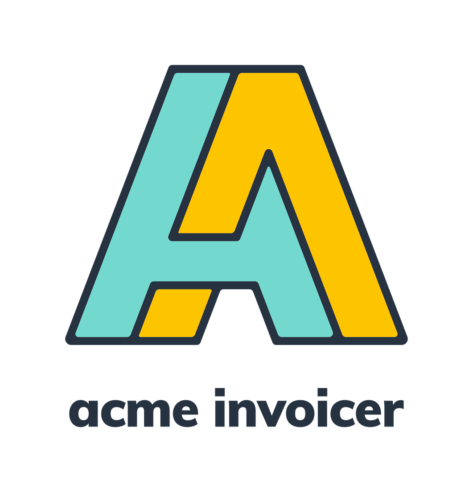
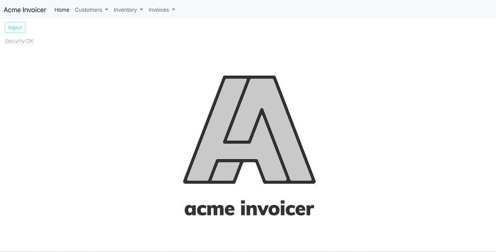
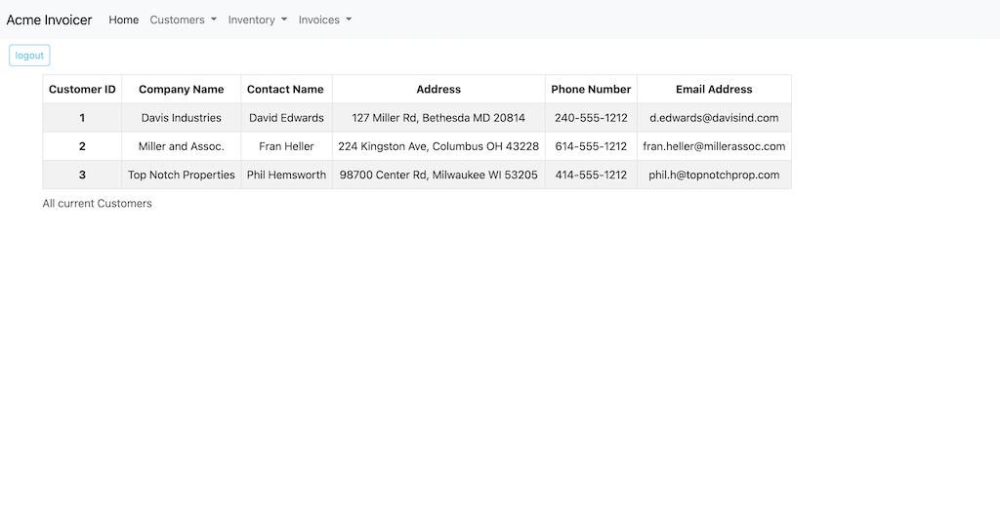

# Acme Invoicer

## Table of Contents-
- [Acme Invoicer](#acme-invoicer)
  - [Table of Contents-](#table-of-contents-)
  - [Licensing](#licensing)
  - [Description](#description)
  - [Installation](#installation)
  - [Screenshots](#screenshots)
  - [Usage](#usage)
  - [Credits](#credits)
  - [Contributing](#contributing)
  - [Testing](#testing)
  - [Additional Info](#additional-info)

## Licensing

Link: [MIT License](https://opensource.org/licenses/MIT)

## Description

This is a simple Business Management system that allows the user to enter customer data, manage item inventory, and create invoices and send them to the customers for billing.
     
## Installation

NOTE: As of November 2022, Heroku has no "free" accounts, so the demo application has been taken offline until another suitable host can be found.

Can also be installed locally by copying directory structure as-is, then doing a `npm install` in the base directory to install necessary dependancies. Application database is MySql, and the database container can be created by navigating to the `/db `directory and then using the MySQL command line utility and the `SOURCE` command to create it. Data tables can be seeded into the container after this my navigating to the `/seeds `directory and using the command `node index.js` to create them.

## Screenshots

## Usage

Running `node server.js` in the base directory after dependancies have been installed launches the application. Opening a web browser and navigating to the URL `http://http://localhost:3001/` will show the user login prompts, and if there are no accounts available one can be created.

The drop down menus in the application will give you the option to work with 'Customer' infomation, work with Inventory information, or work with Invoice information. 

## Credits

This application was created by the team of Cliff Rosenberg, Daniel Leake, Leo Morales, Matt Gonzales using the following technologies and libraries:

[Express](https://expressjs.com/)

[MySQL v8.0](https://www.mysql.com/)

[Sequelize v6](https://sequelize.org/)

[Nodemailer](https://nodemailer.com/about/)

[connect-session-sequelize](https://www.npmjs.com/package/connect-session-sequelize)

[bcrypt](https://www.npmjs.com/package/bcrypt)

[dotenv](https://www.npmjs.com/package/dotenv)

## Contributing

  [Contributor Covenant](https://www.contributor-covenant.org/)

## Testing

  No testing is provided.

## Additional Info

Leo Morales Github - [https://github.com/leomorales1](https://github.com/leomorales1)

Daniel Leake Github - [https://github.com/rensyphon](https://github.com/rensyphon)

Matthew Gonzales Github - [https://github.com/mattyjtx](https://github.com/mattyjtx)

Cliff Rosenberg Github - [https://github.com/cliff-rosenberg](https://github.com/cliff-rosenberg)
